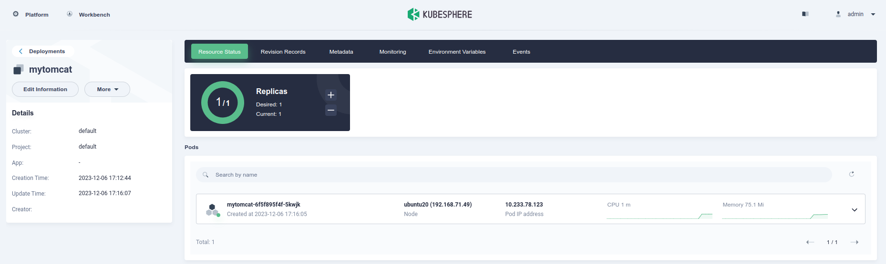
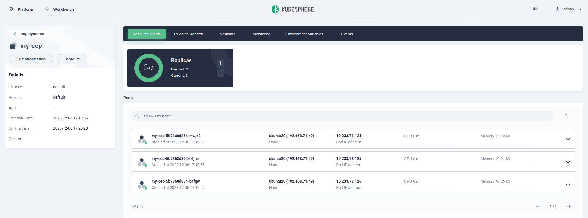
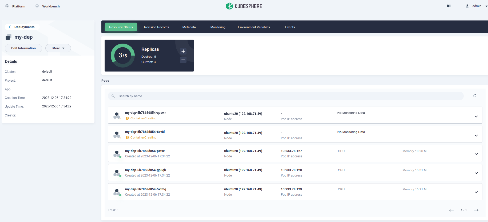
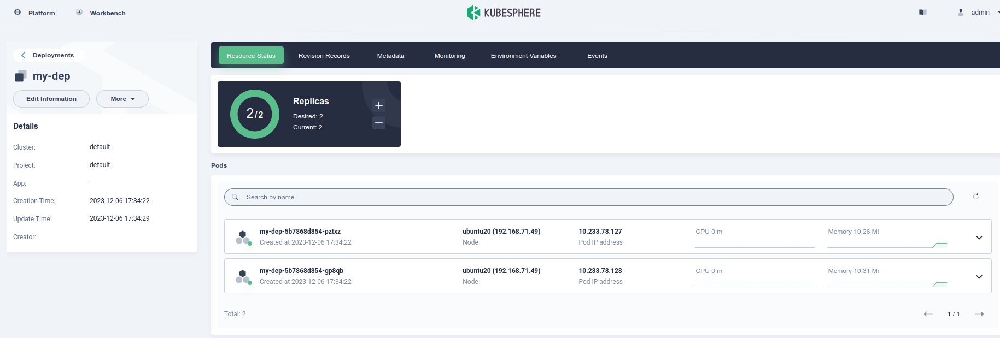

# 创建资源方式

1. 命令行
2. YAML


# Namespace

名称空间用来隔离资源

```shell
#获取
kubectl get ns

#创建
kubectl create ns hello

#删除--会将所属的资源也一并删除
kubectl delete ns hello
```


```yaml
#api版本
apiVersion: v1
#资源类型
kind: Namespace
#元数据
metadata:
  #资源名称
  name: hello	
```

使用方式

```shell
#创建资源
kubectl apply -f hello.yaml

#删除资源
ubectl delete -f hello.yaml
```


# Pod

容器中的一组容器，pod是k8s中应用的最小单位。一个pod里面可以有多个容器。

1.启动一个pod

```shell
kubectl run mynginx --image=nginx
```

2.查看default名称空间的Pod

```shell
root@master:~# kubectl get pod
NAME      READY   STATUS    RESTARTS   AGE
mynginx   1/1     Running   0          36s

#查看其他名称空间的Pod
kubectl get pod -n 空间名
```

3.描述

```shell
root@master:~# kubectl describe pod mynginx
Name:         mynginx
Namespace:    default
Priority:     0
Node:         master/192.168.31.126
Start Time:   Wed, 06 Dec 2023 05:00:29 +0800
Labels:       run=mynginx
Annotations:  cni.projectcalico.org/containerID: 9a2bf9a1c7abb0c3718c4eb9d71ef6b3f2845b974d2b4e3e5bd797b9de71a18e
              cni.projectcalico.org/podIP: 10.233.70.20/32
              cni.projectcalico.org/podIPs: 10.233.70.20/32
Status:       Running
IP:           10.233.70.20
IPs:
  IP:  10.233.70.20
Containers:
  mynginx:
    Container ID:   docker://d1bebed2dea10c6a461d5c5df4ac7f136390aabf92da8226a2bf1f4885048572
    Image:          nginx
    Image ID:       docker-pullable://nginx@sha256:10d1f5b58f74683ad34eb29287e07dab1e90f10af243f151bb50aa5dbb4d62ee
    Port:           <none>
    Host Port:      <none>
    State:          Running
      Started:      Wed, 06 Dec 2023 05:00:48 +0800
    Ready:          True
    Restart Count:  0
    Environment:    <none>
    Mounts:
      /var/run/secrets/kubernetes.io/serviceaccount from kube-api-access-q64gs (ro)
Conditions:
  Type              Status
  Initialized       True 
  Ready             True 
  ContainersReady   True 
  PodScheduled      True 
Volumes:
  kube-api-access-q64gs:
    Type:                    Projected (a volume that contains injected data from multiple sources)
    TokenExpirationSeconds:  3607
    ConfigMapName:           kube-root-ca.crt
    ConfigMapOptional:       <nil>
    DownwardAPI:             true
QoS Class:                   BestEffort
Node-Selectors:              <none>
Tolerations:                 node.kubernetes.io/not-ready:NoExecute op=Exists for 300s
                             node.kubernetes.io/unreachable:NoExecute op=Exists for 300s
#主要看这里
Events:
  Type    Reason     Age    From               Message
  ----    ------     ----   ----               -------
  #3m17s前 def成功分配ault/mynginx到master节点
  Normal  Scheduled  3m17s  default-scheduler  Successfully assigned default/mynginx to master
  #3m16s前 下载nginx镜像
  Normal  Pulling    3m16s  kubelet            Pulling image "nginx"
  #2m59s前 下载好nginx镜像
  Normal  Pulled     2m59s  kubelet            Successfully pulled image "nginx" in 16.779350418s
  #2m58s前 创建容器mynginx
  Normal  Created    2m58s  kubelet            Created container mynginx
  #2m58s前 启容器mynginx
  Normal  Started    2m58s  kubelet            Started container mynginx
```

4.删除pod

```shell
kubectl delete pod mynginx
```


5.yaml方式

```yaml
apiVersion: v1
kind: Pod
metadata:
  labels:
    run: mynginx
  name: mynginx
#  namespace: default
spec:
  containers:
  - image: nginx
    name: mynginx
```


# Deployment

控制Pod，使Pod拥有多副本，自愈，扩缩容等能力

```shell
kubectl create deployment mytomcat --image=tomcat:8.5.68
```

效果

```shell
root@ubuntu20:~# kubectl create deployment mytomcat --image=tomcat:8.5.68
deployment.apps/mytomcat created
root@ubuntu20:~# kubectl get pods
NAME                        READY   STATUS    RESTARTS   AGE
mytomcat-6f5f895f4f-qnscg   1/1     Running   0          25s
root@ubuntu20:~# kubectl delete pod mytomcat-6f5f895f4f-qnscg
pod "mytomcat-6f5f895f4f-qnscg" deleted
root@ubuntu20:~# kubectl get pods
NAME                        READY   STATUS    RESTARTS   AGE
mytomcat-6f5f895f4f-5kwjk   1/1     Running   0          17s #删除了一个pod，deployment又创建了一个pod。
```




多副本

```shell
kubectl create deployment my-dep --image=nginx --replicas=3
```

```shell
root@ubuntu20:~# kubectl describe deployment my-dep
Name:                   my-dep
Namespace:              default
CreationTimestamp:      Wed, 06 Dec 2023 17:19:56 +0800
Labels:                 app=my-dep
Annotations:            deployment.kubernetes.io/revision: 1
Selector:               app=my-dep
Replicas:               3 desired | 3 updated | 3 total | 3 available | 0 unavailable
StrategyType:           RollingUpdate
MinReadySeconds:        0
RollingUpdateStrategy:  25% max unavailable, 25% max surge
Pod Template:
  Labels:  app=my-dep
  Containers:
   nginx:
    Image:        nginx
    Port:         <none>
    Host Port:    <none>
    Environment:  <none>
    Mounts:       <none>
  Volumes:        <none>
Conditions:
  Type           Status  Reason
  ----           ------  ------
  Available      True    MinimumReplicasAvailable
  Progressing    True    NewReplicaSetAvailable
OldReplicaSets:  <none>
NewReplicaSet:   my-dep-5b7868d854 (3/3 replicas created)
Events:
  Type    Reason             Age    From                   Message
  ----    ------             ----   ----                   -------
  Normal  ScalingReplicaSet  4m10s  deployment-controller  Scaled up replica set my-dep-5b7868d854 to 3

```

查看pod

```shell
root@ubuntu20:~# kubectl get pods --selector=app=my-dep
NAME                      READY   STATUS    RESTARTS   AGE
my-dep-5b7868d854-b4fqw   1/1     Running   0          6m39s
my-dep-5b7868d854-h6jmr   1/1     Running   0          6m39s
my-dep-5b7868d854-mwjn2   1/1     Running   0          6m39s
```




删除

```shell
kubectl delete deployment my-dep
```


使用yaml方式创建

```yaml
apiVersion: apps/v1
kind: Deployment
metadata:
  labels:
    app: my-dep
  name: my-dep
spec:
  replicas: 3
  selector:
    matchLabels:
      app: my-dep
  template:
    metadata:
      labels:
        app: my-dep
    spec:
      containers:
      - image: nginx
        name: nginx
```


扩容

```shell
kubectl scale --replicas=5 deployment/my-dep
```




缩容

```shell
kubectl edit deployment my-dep
```

修改文件 replicas: 5 >> replicas: 2

```shell
spec:
  progressDeadlineSeconds: 600
  replicas: 5
```

```shell
root@ubuntu20:~# kubectl get pods --selector=app=my-dep
NAME                      READY   STATUS    RESTARTS   AGE
my-dep-5b7868d854-gp8qb   1/1     Running   0          6m29s
my-dep-5b7868d854-pztxz   1/1     Running   0          6m29s
```




